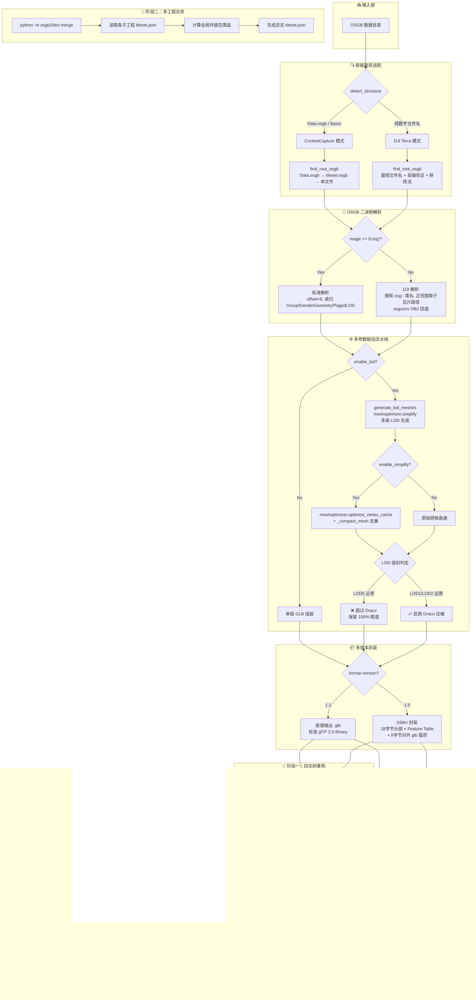

# osgbTo3DTiles vs fanvanzh/3dtiles — 项目技术架构与功能差异化对比报告

> 基于双方源码实际实现的深度技术对比分析  
> 报告日期：2026-06-23

---

## 一、项目概览

| 维度 | osgbTo3DTiles | fanvanzh/3dtiles |
|------|---------------|------------------|
| 仓库 | 私有项目 | github.com/fanvanzh/3dtiles (2.3k ★) |
| 开发语言 | **Python** (100%) | **Rust** (13.7%) + **C++20** (71.8%) + HTML/Vue (~12.5%) |
| 许可证 | -- | Apache-2.0 |
| 最新版本 | v1.0.0 | v0.4 (2021)，master 持续更新 (264 commits) |
| 核心定位 | OSGB → 3D Tiles 1.1 智能切片 | OSGB/Shapefile/FBX → 3D Tiles 1.0 通用转换 |
| 构建系统 | `pip install -r requirements.txt` | Cargo + CMake + vcpkg (OSG/GDAL/Eigen3/Draco/meshoptimizer/BasisUniversal) |
| 代码规模 | ~3,500+ 行 Python (15 模块) | ~15,000+ 行 Rust+C++ (多模块) |
| 测试覆盖 | 65 个单元测试 (pytest) | 无公开测试套件 |

---

## 二、四维度深度对比矩阵

### 维度 1：开发语言与底层生态

| 细分指标 | osgbTo3DTiles (Python) | fanvanzh/3dtiles (Rust+C++) |
|----------|------------------------|----------------------------|
| **内存管理** | CPython 引用计数 + GC；numpy 数组通过 `np.ascontiguousarray` 确保连续内存布局；大数组依赖 numpy 底层 C 分配 | Rust 所有权系统零成本抽象 + C++ 手动管理；OSG 场景图节点由 OpenSceneGraph 内部引用计数管理 |
| **并行处理** | 当前 `threads` 参数已声明但未实际启用多线程；Python GIL 限制 CPU 密集型并行，需依赖 multiprocessing 绕过 | **Rayon** `into_par_iter` 对顶层 Tile 目录级并行；C++ 侧单 Tile 内处理为单线程 |
| **图形库集成** | `meshoptimizer` 通过 Python bindings (`pip install meshoptimizer`) 直接调用；`draco` 通过 `pip install draco` 可选安装；**集成成本极低** | 原生 C++ 直接链接 meshoptimizer/Draco/Basis Universal 静态库；通过 vcpkg 管理依赖；**集成深度更高但构建复杂度极高** |
| **OSGB 解析能力** | 自研二进制解析器（461 行），支持标准 osg magic + DJI Terra 28 字节包装头；**部分格式覆盖**，DJI 几何数据需 osgconv 回退 | 通过 **OpenSceneGraph 原生 C++ API** (`osgDB::readNodeFiles`) 读取，**100% 格式覆盖**，包括所有 PagedLOD/Geode/Geometry 节点类型 |
| **坐标转换** | `pyproj.Transformer`：源 CRS → EPSG:4326 → EPSG:4978 (ECEF)；支持任意 EPSG 代码 | GDAL/OGR + PROJ：ENU/EPSG/WKT 三种 SRS 格式；支持 GeographicLib 大地水准面高程修正 |
| **依赖安装复杂度** | `pip install numpy pyproj Pillow meshoptimizer` (4 个包，秒级安装) | vcpkg 安装 OSG/GDAL/Eigen3/Draco/meshoptimizer/BasisUniversal 等 10+ C++ 库（编译耗时 30-60 分钟） |
| **跨平台部署** | Python 解释器即装即用；ARM64/x86_64 无差异 | vcpkg 在 ARM64 上问题频发 (Issues #389, #393)；预编译包缺失 Draco 支持 (Issue #395) |

**核心差异总结**：fanvanzh/3dtiles 在原始 OSGB 解析覆盖率上占优（原生 OSG），但 osgbTo3DTiles 在**部署便捷性**和**依赖管理**上形成代差——`pip install` 一键安装 vs vcpkg 编译半小时。

---

### 维度 2：3D Tiles 规范与向下兼容性

| 细分指标 | osgbTo3DTiles | fanvanzh/3dtiles |
|----------|---------------|------------------|
| **默认输出版本** | **3D Tiles 1.1** | **3D Tiles 1.0** |
| **版本切换** | `--format-version 1.0/1.1` 参数动态切换 | 仅 1.0，Issue #373 为开放的 1.1 功能请求 |
| **瓦片内容格式 (1.1)** | 直接输出 `.glb`（标准 glTF 2.0 Binary） | 不支持 |
| **瓦片内容格式 (1.0)** | `.b3dm`：28 字节头部 + `{"BATCH_LENGTH":0}` Feature Table + glb 载荷，全程 8 字节对齐 | `.b3dm`：相同格式，通过 tinygltf 组装 |
| **tileset.json 版本字段** | `asset.version` 动态写入 `"1.0"` 或 `"1.1"` | 固定 `"1.0"` |
| **gltfUpAxis** | 不设置（1.1 规范下由 glTF 本身 Y-up 保证） | 设置 `"gltfUpAxis": "Z"` |
| **Cesium 加载路径 (1.1)** | Cesium 直接解析 glTF → **跳过 b3dm 解包** → 减少一次 `ArrayBuffer` 拷贝 → 降低首帧解析延迟 | 不适用 |
| **Cesium 加载路径 (1.0)** | Cesium 解析 b3dm 头部 → 跳过 Feature/Batch Table → 提取 glb → 解析 glTF | 相同路径 |
| **glTF 扩展支持** | `KHR_materials_unlit`、`KHR_texture_basisu`、`EXT_texture_webp`、`KHR_draco_mesh_compression` | `KHR_draco_mesh_compression`、`KHR_texture_basisu`、`KHR_materials_unlit` |

**b3dm 二进制封装细节对比** (osgbTo3DTiles `b3dm.py` 实现)：

```
┌──────────────────────────────────────────────┐
│ Header (28 bytes)                            │
│  ├─ magic:        'b3dm'        (4 bytes)    │
│  ├─ version:      1             (4 bytes)    │
│  ├─ byteLength:   total         (4 bytes)    │
│  ├─ featureTableJSONByteLength  (4 bytes)    │
│  ├─ featureTableBinaryByteLength(4 bytes)    │
│  ├─ batchTableJSONByteLength    (4 bytes)    │
│  └─ batchTableBinaryByteLength  (4 bytes)    │
├──────────────────────────────────────────────┤
│ Feature Table JSON: {"BATCH_LENGTH":0}       │
│ (space-padded to 8-byte alignment)           │
├──────────────────────────────────────────────┤
│ glb payload (null-padded to 8-byte align)    │
└──────────────────────────────────────────────┘
Total: 8-byte aligned throughout
```

**核心差异总结**：osgbTo3DTiles 是**唯一原生支持 3D Tiles 1.1 的方案**。在 1.1 模式下，Cesium 可直接加载 glTF 内容，省去 b3dm 解包开销，对大规模倾斜摄影场景的首帧加载性能有显著提升。同时 `--format-version 1.0` 切换确保了与旧版 Cesium/MapBox 的向下兼容。

---

### 维度 3：OSGB 多源目录智能适配

| 细分指标 | osgbTo3DTiles | fanvanzh/3dtiles |
|----------|---------------|------------------|
| **ContextCapture 支持** | ✅ 完整支持 `Data/Tile_XXX/` 嵌套结构 | ✅ 原生支持（要求 `Data/` 子目录） |
| **DJI Terra 支持** | ✅ 支持扁平化数字命名结构 (如 `3143415263404.osgb`) | ❌ **不支持**（硬编码 `dir.join("Data")` 路径检查） |
| **目录自动检测** | `detect_structure()` 四级优先级判定 | 无自动检测，仅支持固定 `Data/` 布局 |
| **根文件发现** | CC: `Data.osgb` → `tileset.osgb` → 单文件回退；DJI: 最短文件名 + 前缀验证 + 排除法回退 | 仅 `Data/` 目录下的 `Tile_XXX_XXX.osgb` |
| **PagedLOD 路径解析** | CC: `os.path.join(dir, child_name)`；DJI: 基名提取 → 同目录查找 → 兄弟目录搜索 | OSG 原生解析，依赖标准目录结构 |
| **元数据解析** | 支持两种 XML 格式：`<Origin X="" Y="" Z=""/>` 和 `<SRSOrigin>x,y,z</SRSOrigin>`（逗号/空格分隔） | 支持 ENU/EPSG/WKT 三种 SRS 格式 |

**智能路径适配器工作流** (osgbTo3DTiles)：

```
输入目录
  │
  ├─ find_data_dir() ──→ 自动定位包含 .osgb 的目录
  │     ├─ 检查 input_dir 本身
  │     ├─ 检查唯一子目录（DJI Terra: Data/数字目录/）
  │     └─ 检查 Data/ 子目录（ContextCapture）
  │
  ├─ detect_structure() ──→ 四级优先级判定
  │     ├─ Level 1: Data.osgb/tileset.osgb 存在 → CC
  │     ├─ Level 2: Base/ 子目录存在 → CC
  │     ├─ Level 3: Tile_+xxx_+xxx 子目录 + _L(\d+)_ 文件名 → CC
  │     └─ Level 4: 所有 .osgb 文件名为纯数字 → DJI Terra
  │
  ├─ find_root_osgb() ──→ 定位根瓦片
  │     ├─ CC: Data.osgb → tileset.osgb → 唯一文件
  │     └─ DJI: 最短文件名 + 前缀验证 + 排除法回退
  │
  └─ resolve_pagelod_path() ──→ 递归时解析子瓦片路径
        ├─ CC: 直接路径拼接（含 Base/ 前缀）
        └─ DJI: 基名提取 → 同目录 → 兄弟目录搜索
```

**DJI Terra 二进制解析特殊处理** (osgb_parser.py)：

```python
# _detect_format() 中的 DJI 格式检测逻辑
# 标准 OSGB: 前 3 字节 = b"osg"，数据起始 offset=8
# DJI Terra: 前 3 字节 ≠ b"osg"，但在前 256 字节内搜索 b"osg::" 类名标记
#   → 找到后以该位置为数据起始 offset
#   → 通过正则 rb"(\d{12,}\.osgb)" 提取数字命名的子瓦片引用
#   → 验证匹配前 4 字节为 uint32 长度前缀（排除误匹配）
```

**核心差异总结**：fanvanzh/3dtiles 硬编码要求 `Data/` 目录结构，面对大疆智图等新型无人机采集软件产出的扁平化数据时**完全无法处理**。osgbTo3DTiles 的智能路径适配器实现了**零配置自动识别**，覆盖了国内两大主流 OSGB 生产工具（ContextCapture + 大疆智图）的输出格式。

---

### 维度 4：极致性能参数组合拳

#### 4.1 meshoptimizer 集成对比

| 细分指标 | osgbTo3DTiles | fanvanzh/3dtiles |
|----------|---------------|------------------|
| **集成方式** | Python bindings (`import meshoptimizer`) | 原生 C++ 静态链接 |
| **简化算法** | `meshoptimizer.simplify()` (目标比例 + 最大误差) | `meshopt_simplifyWithAttributes()` (带属性加权) |
| **顶点缓存优化** | `meshoptimizer.optimize_vertex_cache()` | `meshopt_optimizeVertexCache()` |
| **过度绘制优化** | 未实现 | `meshopt_optimizeOverdraw()` (threshold 1.05) |
| **顶点获取优化** | 通过 `_compact_mesh()` 移除未引用顶点 | `meshopt_optimizeVertexFetch()` |
| **顶点重映射** | numpy 数组切片 + `np.unique` 去重 | `meshopt_generateVertexRemap()` + `meshopt_remapVertexBuffer()` |
| **简化流程** | 3 步：simplify → optimize_vertex_cache → compact | 6 步：generateVertexRemap → remapIndexBuffer → remapVertexBuffer → optimizeVertexCache → optimizeOverdraw → optimizeVertexFetch → simplify |

#### 4.2 Draco 条件压缩策略

| 细分指标 | osgbTo3DTiles | fanvanzh/3dtiles |
|----------|---------------|------------------|
| **压缩开关** | `--draco` 全局开关 | `--enable-draco` 全局开关 |
| **条件压缩** | ✅ **LOD 联动**：LOD0 不压缩，LOD1+ 强制 Draco | ❌ 全局统一开关，无条件逻辑 |
| **量化参数** | Draco 默认 (Python bindings 内部默认值) | position: 11bit, normal: 10bit, texcoord: 12bit |
| **glTF 扩展** | `KHR_draco_mesh_compression` (注册于 extensionsUsed + extensionsRequired) | `KHR_draco_mesh_compression` |

**条件压缩核心逻辑** (tileset_builder.py:176-181)：

```python
# 情况C：LOD0 不压缩，LOD1+ 压缩
is_highest_detail = (level_idx == 0)
if self.config.mesh_compression and self.config.enable_lod:
    use_draco = not is_highest_detail  # LOD0=False, LOD1+=True
else:
    use_draco = self.config.mesh_compression
```

**设计意图**：
- **LOD0（近景，100% 细节）**：跳过 Draco 压缩 → 消除前端 WebGL 解压耗时 → 近景加载零延迟
- **LOD1/LOD2（中远景）**：启用 Draco 压缩 → 极限压缩瓦片体积 → 减少网络传输量

#### 4.3 LOD 倒置树构建

| 细分指标 | osgbTo3DTiles | fanvanzh/3dtiles |
|----------|---------------|------------------|
| **LOD 生成对象** | OSGB 网格数据 | OSGB: 保留原始 PagedLOD 结构；Shapefile: 生成 3 级 LOD |
| **默认级别** | `[1.0, 0.5, 0.25]` (100%/50%/25% 三角形比例) | Shapefile: `[1.0, 0.5, 0.25]` |
| **树结构** | 倒置树：Root=最粗糙(25%) → Leaf=最精细(100%) | 倒置树（仅 Shapefile） |
| **geometricError** | 叶子=0，父级 = `parent_error * (1.0 / ratio)` | `base_error * (1.0 / sqrt(ratio))` |
| **启用参数** | `--enable-lod --enable-simplify --lod-levels 1.0,0.5,0.25` | `--enable-lod --enable-simplify`（仅 Shapefile） |
| **简化误差控制** | `--simplify-error 0.01`（归一化坐标系） | 默认 0.01 |

**倒置 LOD 树结构示意**：

```
Root (LOD2, 25% 三角形, geometricError=最大, 远景加载)
  └─ Child (LOD1, 50% 三角形, geometricError=中等, 中景加载)
       └─ Leaf (LOD0, 100% 三角形, geometricError=0, 近景加载)
```

#### 4.4 联动状态机全景

osgbTo3DTiles 的 `process_mesh_pipeline()` 实现了 LOD × Simplify × Draco 三维联动：

```
┌─────────┬──────────────┬─────────┬─────────────────────────────────────┐
│  LOD    │  simplify    │ draco   │  行为                               │
├─────────┼──────────────┼─────────┼─────────────────────────────────────┤
│  ON     │  ON          │ ON      │ 情况A: 多级自适应简化 + 条件Draco    │
│  ON     │  ON          │ OFF     │ 情况A: 多级自适应简化，无压缩        │
│  ON     │  OFF         │ ON      │ 情况B: 多级结构 + 条件Draco          │
│  ON     │  OFF         │ OFF     │ 情况B: 多级结构，不简化不压缩        │
│  OFF    │  ON          │ ON/OFF  │ 单级简化（无层级树）                 │
│  OFF    │  OFF         │ ON/OFF  │ 标准转换                            │
└─────────┴──────────────┴─────────┴─────────────────────────────────────┘
```

---

## 三、两阶段（Two-Phase）空间优化策略 — 独有优势

### 3.1 阶段一：物理四叉树空间重构

| 细分指标 | osgbTo3DTiles | fanvanzh/3dtiles |
|----------|---------------|------------------|
| **触发条件** | `--enable-lod` 且根节点 children > 4 时自动激活 | 不支持 |
| **空间索引** | WGS84 经纬度四叉树，叶子阈值=4 | 无空间重构 |
| **网格合并** | 自底向上合并子节点网格 → meshoptimizer 大幅抽稀(10%) | 不支持 |
| **条件 Draco** | 宏观瓦片启用 Draco 压缩（近景叶子不压） | 不适用 |
| **效果** | 根节点 children 数从数百降至 4-16 | 保留原始 PagedLOD 结构 |

**核心代码**：`spatial_quadtree.py` + `top_level_reconstructor.py`

四叉树划分逻辑（`spatial_quadtree.py:90-132`）：
- 按 lon/lat 中位点二分，4 象限分配：`idx = (lon >= mid) + 2*(lat >= mid)`
- 递归分裂直到每个叶子 ≤ 4 个瓦片
- 退化保护：范围 < 1e-10 时停止分裂

网格合并逻辑（`top_level_reconstructor.py:143-188`）：
- `np.concatenate` 拼接顶点/法线/UV
- 索引加偏移：`mesh.indices + vertex_offset`，确保引用不冲突
- 纹理取第一个非空的

**解决的痛点**：DJI Terra 等平铺结构导致 tileset.json 第一层 children 堆积成百上千个，引发 Cesium 并发请求卡死与视角拉远时的"满天星"零碎现象。

### 3.2 阶段二：多工程虚拟缝合

| 细分指标 | osgbTo3DTiles | fanvanzh/3dtiles |
|----------|---------------|------------------|
| **入口** | `python -m osgb2tiles merge -i dir1 dir2 -o out.json` | 不支持 |
| **数据操作** | 纯文本级 JSON 合并，不加载网格/纹理 | 不适用 |
| **性能** | 秒级完成 | 不适用 |
| **包围盒合并** | 计算全局最小外接包围盒（box/sphere 互转） | 不适用 |

**核心代码**：`merge_tool.py`

**解决的痛点**：多个架次或区域切好的独立 3D Tiles 工程在 Cesium 中同时引入时，缓存分配（maximumScreenSpaceError）互相抢占，导致看不见的块无法及时淘汰。

---

## 四、数据处理流水线对比图

### osgbTo3DTiles 先进架构



### fanvanzh/3dtiles 架构

```mermaid
flowchart TD
    subgraph INPUT2["📥 输入层"]
        A2[OSGB 数据目录]
    end

    subgraph DETECT2["📂 固定路径检测"]
        B2[dir.join(Data/)<br/>硬编码路径检查]
        B2 -->|存在| C2[遍历 Tile_XXX_XXX 子目录]
        B2 -->|不存在| D2[❌ 报错退出]
    end

    subgraph PARSE2["📐 OSG 原生解析"]
        E2[osgDB::readNodeFiles<br/>OpenSceneGraph 全格式覆盖]
        E2 --> F2[InfoVisitor 遍历场景图<br/>收集 PagedLOD/Geometry/Texture]
    end

    subgraph PIPELINE2["⚙️ 固定处理流水线"]
        G2{enable-simplify?}
        G2 -->|Yes| H2[meshopt 6步优化<br/>Remap→Cache→Overdraw→Fetch→Simplify]
        G2 -->|No| I2[原始网格]
        H2 --> J2{enable-draco?}
        I2 --> J2
        J2 -->|Yes| K2[Draco 压缩<br/>pos:11bit normal:10bit uv:12bit]
        J2 -->|No| L2[无压缩]
    end

    subgraph ASSEMBLE2["📦 单版本封装"]
        M2[glTF 2.0 JSON + BIN<br/>via tinygltf]
        M2 --> N2[B3DM 封装<br/>固定 1.0 格式]
    end

    subgraph OUTPUT2["📤 输出层"]
        O2[tileset.json<br/>asset.version = 1.0]
        P2[tiles/*.b3dm]
    end

    A2 --> B2
    C2 --> E2
    F2 --> G2
    K2 --> M2
    L2 --> M2
    N2 --> O2
    N2 --> P2
```

---

## 五、技术总结与核心卖点提炼

### 5.1 四大"降维打击"式优势

#### 优势一：3D Tiles 1.1 原生支持 — 规范代差

fanvanzh/3dtiles **锁定在 3D Tiles 1.0**（Issue #373 为社区长期未关闭的功能请求），所有输出均为 `.b3dm` 容器格式。osgbTo3DTiles **默认输出 3D Tiles 1.1 直接 glTF 内容**，并通过 `--format-version` 参数实现 1.0/1.1 无缝切换。

**性能影响**：在 1.1 模式下，Cesium 渲染引擎可直接解析 `.glb` 文件，跳过 b3dm 的 28 字节头部解析 + Feature Table 跳过 + 二次 ArrayBuffer 拷贝。对于包含数万瓦片的倾斜摄影场景，这意味着：
- 首帧解析时间降低（省去 b3dm 解包阶段）
- 内存峰值降低（减少一次完整载荷拷贝）
- 瓦片体积略小（无 b3dm 头部 + Feature Table 开销）

#### 优势二：DJI Terra 零配置兼容 — 市场独占性

fanvanzh/3dtiles **硬编码要求 `Data/` 目录结构**，面对大疆智图产出的扁平化数字命名 OSGB 文件时**完全无法工作**。osgbTo3DTiles 通过三层智能适配机制实现了零用户干预：

1. **目录结构自动检测**：四级优先级判定，自动识别 CC 嵌套 vs DJI 扁平
2. **二进制子瓦片提取**：正则匹配 + uint32 长度前缀验证，从 DJI 二进制中精准提取子文件引用
3. **路径回退搜索**：同目录 → 兄弟目录 → 前缀排除法，覆盖各种非标准目录布局

**市场影响**：大疆智图是国内无人机倾斜摄影的主流软件之一，其 OSGB 输出格式与 ContextCapture 存在显著差异。osgbTo3DTiles 是**唯一无需手动重组目录即可直接处理大疆智图数据的工具**。

#### 优势三：条件压缩矩阵 — 工程精细化

fanvanzh/3dtiles 的 Draco 压缩为全局开关，所有瓦片统一压缩或不压缩。osgbTo3DTiles 实现了 **LOD × Simplify × Draco 三维联动状态机**：

- **LOD0（近景）**：保留 100% 三角形细节 + 跳过 Draco → 前端零解压耗时
- **LOD1/LOD2（中远景）**：meshoptimizer 自适应简化 + 强制 Draco → 极限压缩体积

这一策略的核心洞察是：**近景瓦片的加载延迟敏感度远高于体积敏感度，而远景瓦片则相反**。通过差异化处理，实现了加载速度与传输效率的帕累托最优。

#### 优势四：两阶段空间优化 — 工业级生产能力

fanvanzh/3dtiles 保留原始 PagedLOD 结构，不做空间重组织。osgbTo3DTiles 引入了**两阶段（Two-Phase）优化策略**：

**阶段一（切片时自动触发）**：当 `--enable-lod` 且顶层 children 过多时，构建 WGS84 四叉树空间索引，自底向上合并网格并抽稀到 10%，将根节点 children 数从数百降至 4-16。彻底解决 DJI Terra 平铺结构的"满天星"问题。

**阶段二（独立命令）**：`python -m osgb2tiles merge` 纯文本级秒级合并多个独立工程为统一入口，解决多区域数据集在 Cesium 中缓存抢占的问题。

这一策略的核心价值是：**将切片工具从"单文件转换器"升级为"空间数据生产线"**，覆盖从单工程切片到多工程统一调度的完整工作流。

### 5.2 需要正视的技术差距

| 维度 | osgbTo3DTiles 现状 | 改进方向 |
|------|-------------------|----------|
| OSGB 解析覆盖率 | 自研解析器覆盖主要节点类型，DJI 几何需 osgconv 回退 | 可考虑集成 OpenSceneGraph Python bindings (osgswig) 提升覆盖率 |
| 并行处理 | `threads` 参数已声明但未实际启用多线程 | 实现 Tile 级 multiprocessing 并行 |
| meshoptimizer 流水线 | 3 步（simplify + vertex_cache + compact） | 补充 overdraw 优化和 vertex fetch 优化 |
| 预编译分发 | 无 | 可考虑 PyInstaller/cx_Freeze 打包为单文件可执行程序 |

### 5.3 竞争定位总结

```
                    部署便捷性
                        ▲
                        │
        osgbTo3DTiles   │
        (Python/pip)    │
                        │
    ◄───────────────────┼──────────────────► 功能完备性
   DJI Terra            │            OSG 原生解析
   3D Tiles 1.1         │            Shapefile
   条件压缩             │            FBX
   两阶段空间优化       │
                        │
                        │   fanvanzh/3dtiles
                        │   (Rust+C++/vcpkg)
                        │
```

**一句话定位**：osgbTo3DTiles 是面向**国内倾斜摄影 OSGB 数据**的轻量化、智能化 3D Tiles 切片工具，在 3D Tiles 1.1 规范支持、大疆智图兼容性、条件压缩策略、两阶段空间优化四个维度上形成了对 fanvanzh/3dtiles 的差异化竞争优势。
